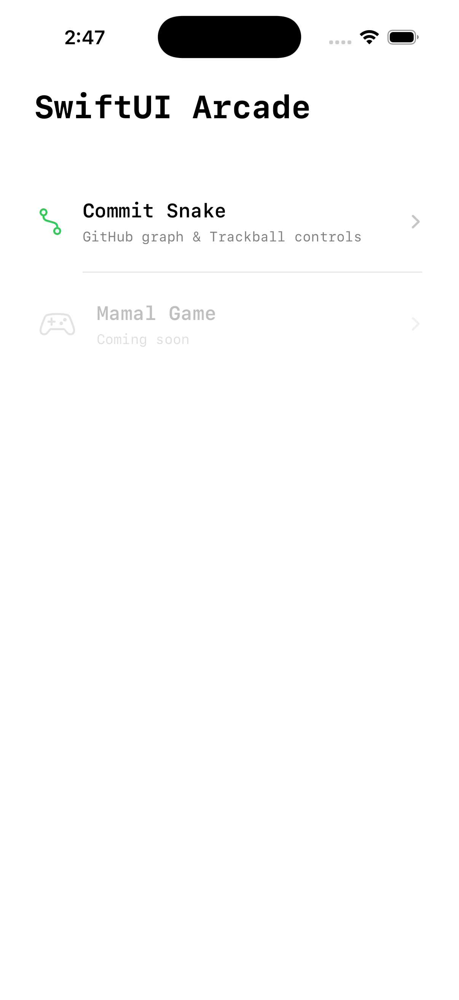

# SwiftUI Games 🎮

A collection of interactive mini-games built with SwiftUI, showcasing modern iOS development techniques and creative implementations.

## Features

- **Modular Architecture**: Clean enum-based routing system for easy game addition
- **SwiftUI Native**: Built entirely with SwiftUI for smooth iOS performance
- **Multiple Games**: Growing collection of unique game experiences
- **Modern iOS**: Leverages latest SwiftUI features and APIs

## 🕹️ Games & Screenshots(gifs)

### Commit Snake
GitHub inspired snake game with trackball controls
- Navigate through a GitHub contribution graph
- Smooth trackball-based movement
- Retro gaming meets developer culture

### More Coming Soon!
Additional games in development...

<table>
  <tr>
    <td></td>
    <td></td>
  </tr>
</table>

## 🤝 Contributing

Contributions are welcome! Feel free to:
- Add new games
- Improve existing games
- Enhance the architecture
- Fix bugs
- Improve documentation

---

#### This project is licensed under the MIT License

---

**Note**: This is a learning project showcasing SwiftUI capabilities. Feel free to use it as a reference for your own projects!
