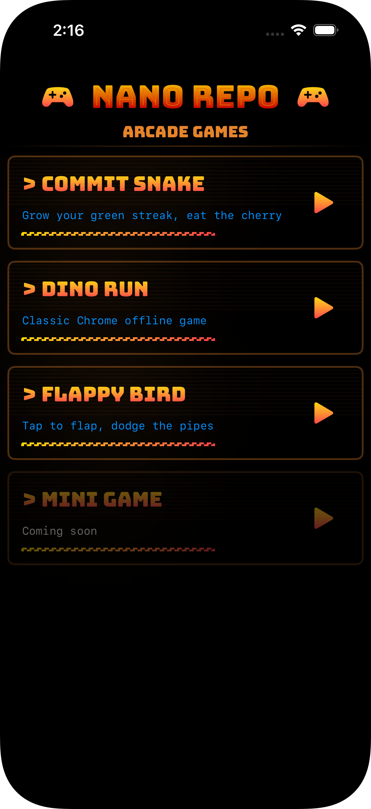
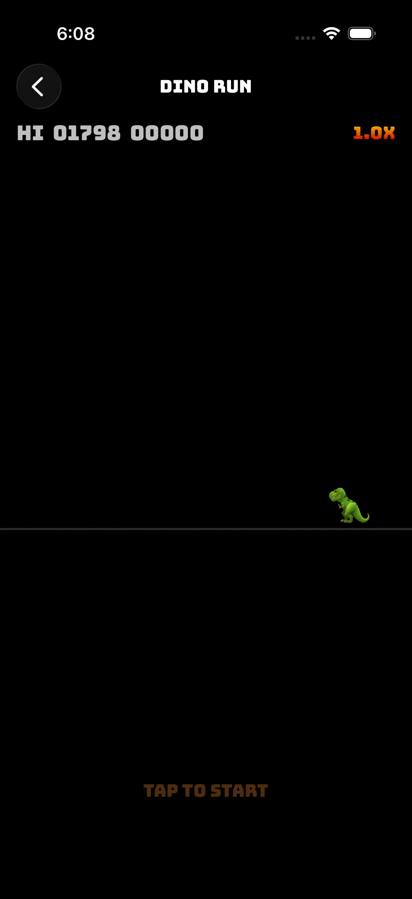
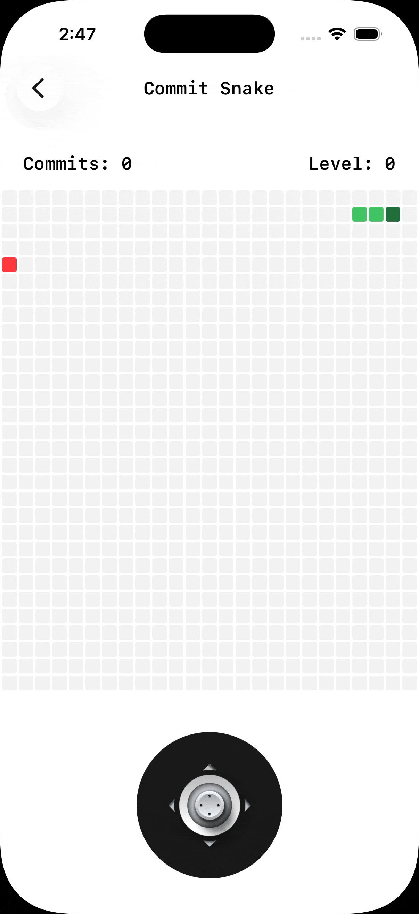

# SwiftUI Games 🎮

A collection of interactive mini-games built with SwiftUI, showcasing modern iOS development techniques and creative implementations.

## Features

- **Modular Architecture**: Clean enum-based routing system for easy game addition
- **SwiftUI Native**: Built entirely with SwiftUI for smooth iOS performance
- **Multiple Games**: Growing collection of unique game experiences
- **Modern iOS**: Leverages latest SwiftUI features and APIs

## 🕹️ Games & Screenshots(gifs)

> - Commit Snake
> - Dino Run
> - Flappy Bird

<table>
  <tr>
    <td width="25%"></td>
    <td width="25%"></td>
    <td width="25%"></td>
    <td width="25%"></td>
  </tr>
</table>

## 🤝 Contributing

Contributions are welcome! Feel free to:
- Add new games
- Improve existing games
- Enhance the architecture
- Fix bugs
- Improve documentation

---

#### This project is licensed under the MIT License