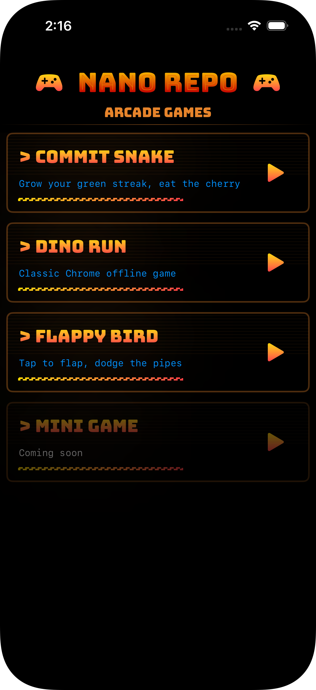
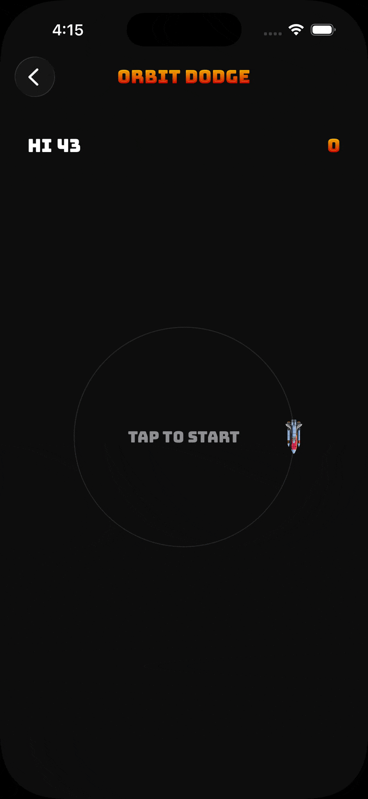
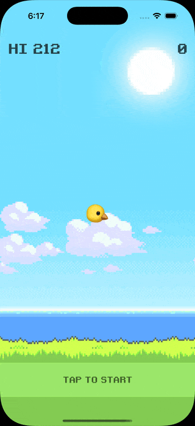
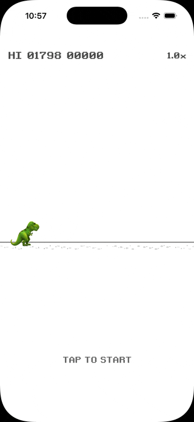
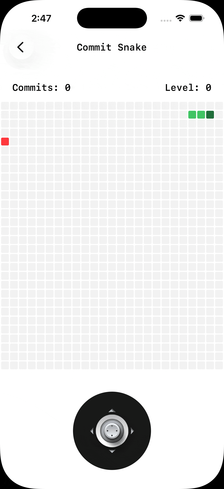

# SwiftUI Games 🎮

A growing collection of arcade mini-games built entirely with SwiftUI! no SpriteKit, no GameplayKit. Just pure SwiftUI and Swift Concurrency.

---

## 🕹️ Games

<table>
  <tr align="center">
    <td width="25%">
      
    </td>
    <td width="25%">
      
    </td>
    <td width="25%">
      
    </td>
    <td width="25%">
      
    </td>
  </tr>
  <tr align="center">
    <td width="25%">
      
    </td>
  </tr>
</table>

---

## ✨ What's Under the Hood

Every game in this collection is built around the same core techniques:

- **60/30 FPS game loop** — driven by Swift Concurrency (`async/await` + `Task` cancellation)
- **State machines** — clean `idle -> playing -> gameOver` transitions with a single input handler
- **Physics from scratch** — gravity, velocity, collision — all hand-tuned per game
- **Emoji-based sprites** — no asset dependencies, runs anywhere
- **Parallax backgrounds** — seamless scrolling layers for depth
- **Haptic feedback** — `UIImpactFeedbackGenerator` tied to game events 
- **Persistent high scores** — `UserDefaults` per game

---

## 🏗️ Architecture

Games are added via a clean enum-based routing system — each game is self-contained with its own route, metadata, and destination view.

```
📦SwiftUI-Games
 ┣ 📂Monorepo
 ┃ ┣ 📂Monorepo
 ┃ ┃ ┣ 📂App
 ┃ ┃ ┃ ┣ 📜MonorepoApp.swift
 ┃ ┃ ┃ ┗ 📜ThemeGradient.swift
 ┃ ┃ ┣ 📂Core
 ┃ ┃ ┃ ┣ 📜ArcadeCard.swift
 ┃ ┃ ┃ ┣ 📜ArcadeHomeView.swift
 ┃ ┃ ┃ ┗ 📜GameRoute.swift
 ┃ ┃ ┣ 📂Extensions
 ┃ ┃ ┃ ┣ 📜Color+Extension.swift
 ┃ ┃ ┃ ┣ 📜Font+Extension.swift
 ┃ ┃ ┃ ┗ 📜View+Extension.swift
 ┃ ┃ ┣ 📂Games
 ┃ ┃ ┃ ┣ 📂CommitSnake
 ┃ ┃ ┃ ┣ 📂DinoRun
 ┃ ┃ ┃ ┣ 📂FlappyBird
 ┃ ┃ ┃ ┣ 📂OrbitDodge
 ┃ ┃ ┃ ┣ 📂Shared
 ┃ ┃ ┃ ┃ ┣ 📜GameBG.swift
 ┃ ┃ ┃ ┃ ┣ 📜GameOverView.swift
 ┃ ┃ ┃ ┃ ┗ 📜GameState.swift
 ┃ ┃ ┣ 📂Resource
 ┃ ┃ ┗ 📜Info.plist
 ┣ 📂gifs
 ┣ 📂images
 ┣ 📜.gitignore
 ┣ 📜CONTRIBUTING.md
 ┣ 📜LICENSE
 ┗ 📜README.md

```

---

## 🤝 Contributing

Contributions are welcome! Feel free to:
- Add new games
- Improve existing game feel or physics
- Enhance the architecture
- Fix bugs or improve documentation

If you add a game, follow the existing pattern — a self-contained `Engine` + `View` pair with a `GameState` enum.

---

## 📄 License

This project is licensed under the MIT License.